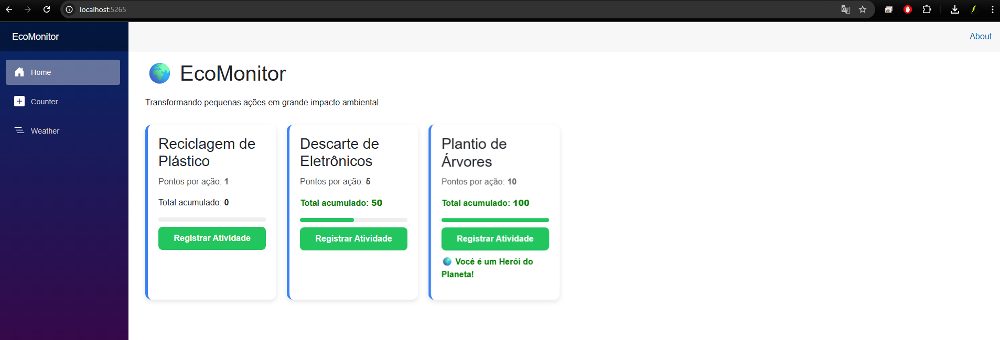

# EcoMonitor

## Identificação
Nome: Luan Mauricio Oliveira Fernandes da Silva
Curso: Ciência da Computação

---

---
## Heurísticas de Nielsen

- **Visibilidade do Status do Sistema**: O sistema apresenta o total acumulado em tempo real, permitindo ao usuário acompanhar seu progresso de forma clara.

- **Feedback do Usuário**: Ao clicar no botão "Registrar Atividade", o sistema responde imediatamente atualizando o contador e a barra de progresso.

---

## Guia de Execução

Para executar o projeto, siga os passos abaixo:

```bash
git clone https://github.com/SEU_USUARIO/una-blazor-lista12.git
cd una-blazor-lista12
dotnet run
